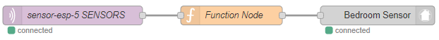

**********
Example Flows
**********
This section of the documentation includes example flows, you're welcome to submit further flows either via a `pull request on GitHub <https://github.com/coldfire84/node-red-alexa-home-skill-v3-web/pulls>`_, via Slack or by contacting `node-red@cb-net.co.uk <mailto:node-red@cb-net.co.uk>`_.

Input Controller
################
This flow shows a simple Input Controller example for a Yamaha MusicCast AV Receiver (using Yamaha AVR Nodes as endpoint).

.. note:: There is no state supported by the InputController capability.

.. image:: _static/images/input-controller-flow.png
    :alt: Screenshot of input controller example flow

Flow code (copy and paste into Node-RED)::

    [{"id":"b2e5a71f.ce6948","type":"alexa-smart-home-v3","z":"affa0b92.8813b8","conf":"bfd0fcf4.bc90e","device":"8","acknowledge":true,"name":"AV Receiver","topic":"","x":130,"y":100,"wires":[["b1cb891c.e1d0a8"]]},{"id":"78b9e3f4.f9401c","type":"AVR-Yamaha-put","z":"affa0b92.8813b8","device":"d15a41e7.73539","name":"Set AVR to Input Payload","topic":"Main_Zone.Input.Input_Sel","payload":"","x":670,"y":100,"wires":[[]]},{"id":"b1cb891c.e1d0a8","type":"change","z":"affa0b92.8813b8","name":"Remove spaces from payload","rules":[{"t":"change","p":"payload","pt":"msg","from":" ","fromt":"str","to":"","tot":"str"}],"action":"","property":"","from":"","to":"","reg":false,"x":390,"y":100,"wires":[["78b9e3f4.f9401c"]]},{"id":"d15a41e7.73539","type":"avr-yamaha","z":"","name":"Lounge AV Receiver","address":"0.0.0.0","port":"","debug":false}]

.. tip:: For this example to work you must install/ use the Yamaha AVR Node-RED nodes.

Playback Controller
################
This flow shows a simple Playback Controller example for a Kodi RPC endpoint (used as a Plex client).

.. note:: There is no state supported by the PlaybackController capability.

.. image:: _static/images/playback-controller-example.png
    :alt: Screenshot of motion sensor example flow

Flow code (copy and paste into Node-RED)::

    [{"id":"519d45a2.45356c","type":"http request","z":"affa0b92.8813b8","name":"Bedroom Kodi Power On","method":"GET","ret":"txt","url":"http://192.169.1.100:8080/jsonrpc?request={\"jsonrpc\":\"2.0\",\"method\":\"Addons.ExecuteAddon\",\"params\":{\"addonid\":\"script.json-cec\",\"params\":{\"command\":\"activate\"}},\"id\":1}","tls":"","x":750,"y":660,"wires":[[]]},{"id":"f2ec1012.29ae2","type":"http request","z":"affa0b92.8813b8","name":"Bedroom Kodi Power Off","method":"GET","ret":"txt","url":"http://192.168.1.100:8080/jsonrpc?request={\"jsonrpc\":\"2.0\",\"method\":\"Addons.ExecuteAddon\",\"params\":{\"addonid\":\"script.json-cec\",\"params\":{\"command\":\"standby\"}},\"id\":1}","tls":"","x":1130,"y":700,"wires":[[]]},{"id":"f99e0eb9.00291","type":"http request","z":"affa0b92.8813b8","name":"Bedroom Kodi Stop","method":"GET","ret":"txt","url":"http://192.168.1.100:8080/jsonrpc?request={\"jsonrpc\":\"2.0\",\"method\":\"Player.Stop\",\"params\":{\"playerid\":1},\"id\":1}","tls":"","x":730,"y":700,"wires":[["eb1ffd69.c955b"]]},{"id":"eb1ffd69.c955b","type":"delay","z":"affa0b92.8813b8","name":"","pauseType":"delay","timeout":"5","timeoutUnits":"seconds","rate":"1","nbRateUnits":"1","rateUnits":"second","randomFirst":"1","randomLast":"5","randomUnits":"seconds","drop":false,"x":940,"y":700,"wires":[["f2ec1012.29ae2"]]},{"id":"7379f6e7.023b28","type":"comment","z":"affa0b92.8813b8","name":"Uses HDMI CEC to Turn on TV","info":"","x":770,"y":620,"wires":[]},{"id":"a917b54d.a91138","type":"switch","z":"affa0b92.8813b8","name":"switch msg.command","property":"command","propertyType":"msg","rules":[{"t":"eq","v":"TurnOn","vt":"str"},{"t":"eq","v":"TurnOff","vt":"str"},{"t":"eq","v":"Pause","vt":"str"},{"t":"eq","v":"Play","vt":"str"},{"t":"eq","v":"Stop","vt":"str"}],"checkall":"true","repair":false,"outputs":5,"x":360,"y":720,"wires":[["519d45a2.45356c"],["f99e0eb9.00291"],["393cc3e.680103c"],["393cc3e.680103c"],["42be5f30.30ed5"]]},{"id":"133b1547.a2447b","type":"alexa-smart-home-v3","z":"affa0b92.8813b8","conf":"bfd0fcf4.bc90e","device":"10","acknowledge":true,"name":"Bedroom TV","topic":"","x":150,"y":720,"wires":[["a917b54d.a91138"]]},{"id":"393cc3e.680103c","type":"http request","z":"affa0b92.8813b8","name":"Bedroom Kodi PlayPause","method":"GET","ret":"txt","url":"http://192.168.1.100:8080/jsonrpc?request={\"jsonrpc\":\"2.0\",\"method\":\"Player.PlayPause\",\"params\":{\"playerid\":1},\"id\":1}","tls":"","x":750,"y":740,"wires":[[]]},{"id":"42be5f30.30ed5","type":"http request","z":"affa0b92.8813b8","name":"Bedroom Kodi Stop","method":"GET","ret":"txt","url":"http://192.168.1.100:8080/jsonrpc?request={\"jsonrpc\":\"2.0\",\"method\":\"Player.Stop\",\"params\":{\"playerid\":1},\"id\":1}","tls":"","x":730,"y":780,"wires":[[]]}]

.. tip:: For this example to work you need to install the Kodi json-cec add-on, and setup fixed/ reserved IP addresses for your Kodi devices.

Motion Sensor
################
.. note:: Google Home does not currently support motion sensors, and as a result you cannot use these devices as triggers to perform other actions.

Use the flow below to send motion sensor updates to Amazon/ Alexa - useful if you want to be able to perform actions that may not be achievable locally via NBode-RED or MQTT (for example getting Alexa to speak or interact with other Alexa-connected smart home devices and services).

.. image:: _static/images/montionsensor-example.png
    :alt: Screenshot of motion sensor example flow

Function code needed to submit the state updates to the Node-RED Smart Home Control service, and in-turn Amazon::

    // Motion State
    if (msg.payload == "ON") {
        return { "payload" : { "state" : { "motion" : "DETECTED" } }, "acknowledge" : true };
    }
    else if (msg.payload == "OFF") {
        return { "payload" : { "state" : { "motion" : "NOT_DETECTED" } }, "acknowledge" : true };
    }

.. tip:: In the majority of cases it will be more performant and more reliable to use your local Node-RED instance or MQTT server perform actions based upon motion sensor state changes.

Temperature Sensor
################
.. note:: Google Home does not currently support dedicated temperature sensors.

Use the flow below to send temperature sensor updates to Amazon/ Alexa, the temperature sensor in this instance is an ESP8266 multi-sensor running `Tasmota <https://github.com/arendst/Tasmota>`_.

An 'MQTT In' node is configured to listen on the relevant multi-sensor Tasmota telemetry topic:

    tele/sensor-esp-5/SENSOR

Whilst the function node code will vary by environment, in this example we take the standard Tasmota telemetry messages and convert the output for use with the state node::

    var jsonPayload = JSON.parse(msg.payload);
    var temperature = jsonPayload.SI7021.Temperature;

    return { "payload" : { "state" : { "temperature" : temperature } }, "acknowledge" : true };
